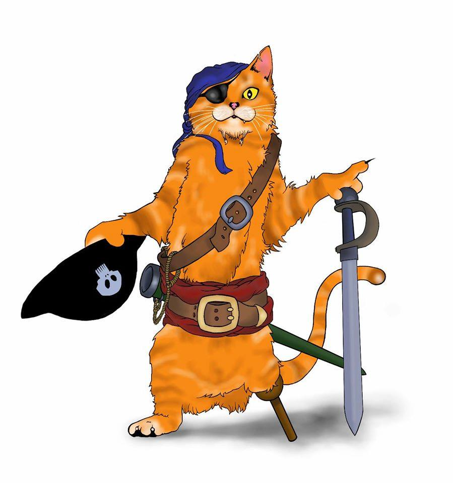

# 🏴‍☠️ The Captain’s Cove

*Recovered from the salt-stained journals of a one-eared feline pirate, these tales are not for the hurried reader. They are for those who listen to the wind, question the stars, and know that rebellion often wears a grin.*

Welcome to **The Captain’s Cove**, a quiet archive of stories from Captain Kitty One Ear - feline wanderer, maritime mischief-maker, and gentle rebel. These tales are offered without commentary, without applause. They are yours to read, ponder, and carry with you.

   
  <em>Captain Kitty One Ear, as remembered by the Archivist.</em>

No comments. No likes. No noise. Just story.

🐾 *Choose a tale, and let the tide take you.*

## Tales from the Captain’s Log

🐾 [Captain Kitty One Ear and the Mango Monster](mango-monster)

🐾 [Captain Kitty One Ear and the dreaded May Cow](the-may-cow)

🐾 [The Island of Chihuahua’s](The-Island-of-Chihuahuas)

🐾 [The Island of Shadow Maw](Island-of-Shadow-Maw.md)

🐾 [The Mysterious Grey Island](Mysterious-Grey-Island.md)

🐾 [Captain Kitty One Ear and the Hollow Ones](Hollow-creatures.md)

🐾 [The Archive of idioms](Archive-of-Idioms.md)

🐾 [Captain Kitty One Ear and the Sea Circus](Sea-Circus.md)

🐾 [George and the Green Sea Turtle](Green-Sea-Turtle.md)

🐾 [The King o’ Crabs](King-o-Crabs.md)

## Author’s Note for Captain Kitty One Ear
Captain Kitty One Ear was born from my love of stories that carry rhythm, adventure, and a sense of place. When I first encountered the dialects, folklore, and musicality of the Cayman Islands, I felt something spark — a joy, a curiosity, and a deep respect for the islands’ rich cultural tapestry.

This story is written as a celebration: an invitation for children everywhere to imagine, appreciate, and explore the beauty of different dialects and traditions. Dialects can be bridges — they open doors to new ways of seeing the world, and they remind us that language carries history, humour, and heart.

Although I am not Caymanian, I have approached this tale with care, research, and admiration. Along the way, I discovered local myths such as the May Cow, and I was struck by how precious and unique these stories are. My hope is that Captain Kitty’s adventures might spark curiosity in young readers — encouraging them to learn more about the Cayman Islands and to value the cultures and voices that make our world so wonderfully varied.

This book is offered in the spirit of respect, celebration, and fun. If it inspires even one child to ask, *“Where did this story come from?”* or *“What else can I discover about the Cayman Islands?”*, then Captain Kitty has done her job well.

